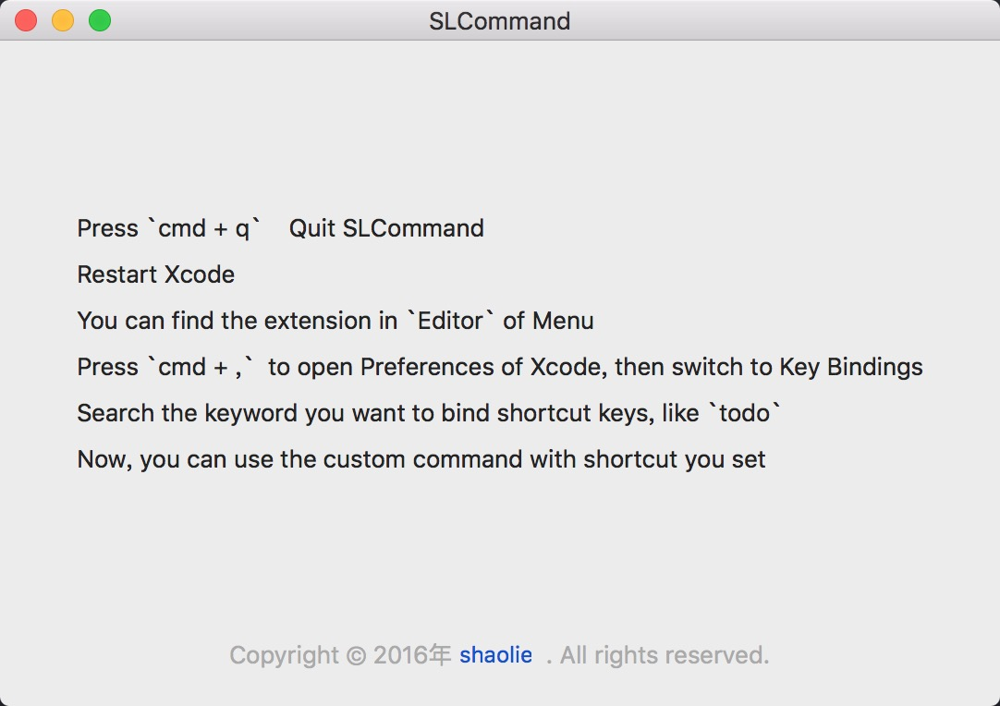
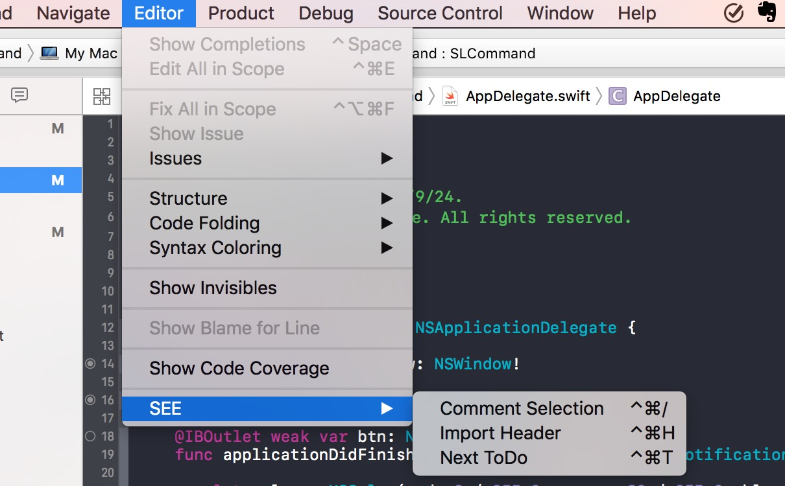

#SLSourceEditorExtension#

Xcode8 出来后，使用插件变得困难。不过苹果提供了新的渠道让开发者开发简单的文本插件 SourceEditorExtension。
SLSourceEditorExtension 是我在使用 Xcode8 中根据平时的需求实现的几个插件，目前有：
1. 注释和解注释；
2. 在当前文件查找TODO；
3. 非智能化自动导入头文件。

由于 Xcode8 的注释命令经常失灵，所以自己实现了一个插件，当 Xcode8 失灵的时候，就能用自己的插件啦，效率杠杠的。

查找 TODO 项用的不多，有时候都是直接 cmd + f 直接查找。不过有时候用起来还是挺方便的。

自动导入头文件，在实现的时候会根据 import 头来判断是在 swift 环境还是 Objective-C 环境。由于开发限制，只能拿到当前文件的文本内容，所以没法像之前那些 AutoImport 什么的插件那么智能。这里只是简单的将选中的文本和 import 进行拼接。然后插入文本。虽然功能有限，不过还是能在开发中大大的提高效率的。

###怎么安装插件###
安装很简单，只需要将 SLCommand 拖动到 应用程序（其他位置也可以） 内，并执行。然后就可以关闭了。接着重启Xcode。这时就能

下面进行演示：

1. 打开 SLCommand 应用

2. CMD + q 退出应用

3. 重新启动 Xcode

4. 在 Xcode 菜单栏上的 Editor 上可以看到自定义的命令了

这里几个命令的快捷键是通过 Xcode -> Preferences -> Key Bindings 进行设置的，你也可以自定义成自己习惯的快捷键（注意不要和其他快捷键冲突了）。

###效果###

